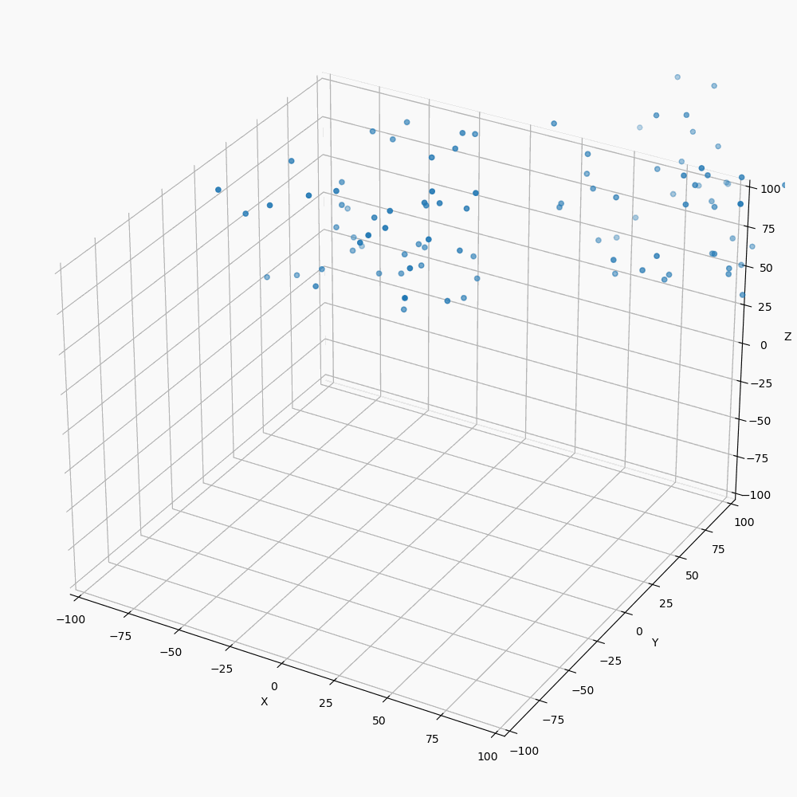
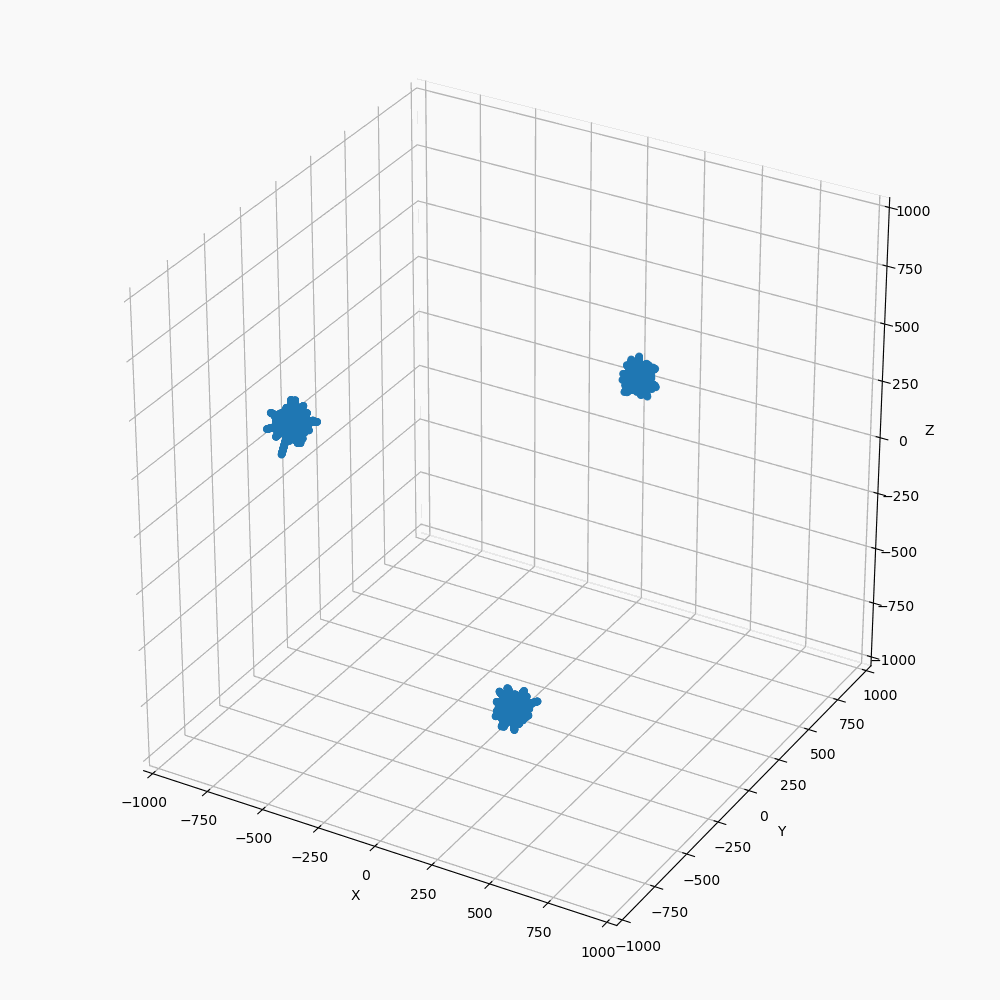
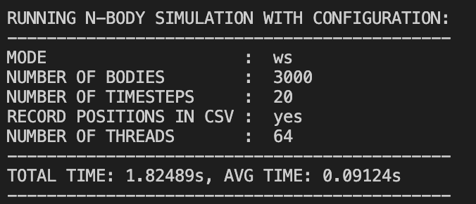
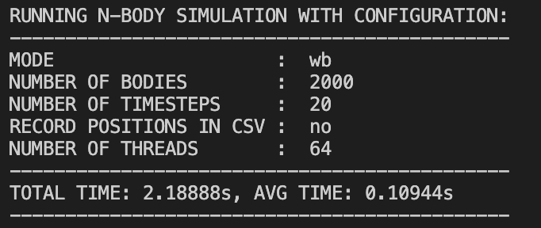

# **The N-Body Problem**
* The N-Body Problem is the problem of predicting the motion of N mutually interacting objects.

* In this project, I try to predict the interaction of self-gravitating bodies, where the forces of interaction described by Newton’s Law of Universal Gravitation.

---
## **Implememtation**
* Both Work-Stealing and Work-Balancing have a Global Queue to which tasks are submitted from the Submit function.
* Each task is wrapped in a future struct that holds the task and a corresposnding channel to which the result of the task or nil as added. Hence the Global queue actually holds futures as tasks.
    ```go
    func (e *ExecService) Submit(task interface{}) Future {
        f := NewFuture(task)
        e.globalQueue.PushBottom(f)
        return f
    }
    ```

* Creating a new ExecService will spawn 'capacity' number of go routines that will spin until the global queue has tasks for them to consume.
    ```go
    go func(e *ExecService) {
        var wg sync.WaitGroup
        wg.Add(capacity)

        for i := 0; i < capacity; i++ {
            localQueueList[i] = NewUnBoundedDEQueue()
        }

        // SPAWN WORKERS
        for i := 0; i < capacity; i++ {
            go worker(e, i, &wg)
        }

        // WAIT FOR EVERYONE TO FINISH WORKING
        wg.Wait()

        // NOTIFY SHUTDOWN ALL TASKS ARE COMPLETED
        execService.wg.Done()
    }(execService)
    ```

* In both versions, each go routine will pop 'threshold' number of tasks from the global queue and add it to its own local queue and starts executing them.
    ```go
    // POLL FROM GLOBAL QUEUE FOR MORE TASKS
    for i := 0; i < execService.threshold; i++ {
        f := execService.globalQueue.PopTop()
        if f == nil {
            break
        }
        execService.localQueueList[workerId].PushBottom(f)
    }
    ```

* The Work Stealing version, uses a work stealing algorithm where each worker tries to steal a task from a randomly chosen victim if polling from the global queue resulted in no tasks being added to the local queue of the wokrer. 
    ```go
    if execService.localQueueList[workerId].IsEmpty() {
        // WORK-STEALING ALGORITHM
        steal := func(victim int) {
            for i := 0; i < execService.threshold; i++ {
                f := execService.localQueueList[victim].PopTop()
                if f == nil {
                    continue
                }
                execService.localQueueList[workerId].PushBottom(f)
            }
        }

        // STEAL FROM VICTIM QUEUE
        victim := random(execService.capacity, workerId)
        steal(victim)
    }
    ```

* The Work Balancing version, each worker tries to balance itself with another randomly chosen queue if the diffrence in sizes is greater than a threshold. The probabilty of a worker trying to load balance is proportional to 1/(size of local queue).
    ```go
    // LOAD BALANCING ALGORITHM
    loadBalancer := func() {
        // RANDOM NUMBER GENERATOR
        random := func(max int, except int) int {
            for {
                rand.Seed(time.Now().UnixNano())
                n := rand.Intn(max)
                if n != except {
                    return n
                }
            }
        }

        sizeLocal := execService.localQueueList[workerId].Size()
        if random(sizeLocal+1, -1) == sizeLocal {
            victim := random(execService.capacity, workerId)
            sizeVictim := execService.localQueueList[victim].Size()

            minQ := execService.localQueueList[victim]
            maxQ := execService.localQueueList[workerId]

            if sizeLocal < sizeVictim {
                minQ = execService.localQueueList[workerId]
                maxQ = execService.localQueueList[victim]
            }

            if maxQ.Size()-minQ.Size() > thresholdBalance {
                for i := 0; i < (maxQ.Size()-minQ.Size())/2; i++ {
                    f := maxQ.PopTop()
                    minQ.PushBottom(f)
                }
            }
        }
    }
    ```

*  N-Body struct
    ```go
    type Body struct {
        x, y, z    float32 // POSITIONS
        vx, vy, vz float32 // VELOCITIES
    }
    ```
* There are four parts to the problem

  1. Initialize the bodies with positions and initial velocities.
        ```go 
        // initialize n bodies with random positions and velocities
        func InitPositionsAndVelocities(id int, bodies []*Body, numBodies int) {
            random := func(a, b float32) float32 {
                return a + rand.Float32()*b
            }

            bodies[id] = NewBody()

            // divide n bodies into 3 clusters
            if id%3 == 0 {
                bodies[id].x = -1000.0 + random(-2.2, 3.3)
                bodies[id].y = 0.0 + random(-2.2, 3.3)
                bodies[id].z = 0.0 + random(-2.2, 3.3)
            } else if id%3 == 1 {
                bodies[id].x = 0.0 + random(-2.2, 3.3)
                bodies[id].y = 0.0 + random(-2.2, 3.3)
                bodies[id].z = -1000.0 + random(-2.2, 3.3)
            } else {
                bodies[id].x = 0.0 + random(-2.2, 3.3)
                bodies[id].y = 1000.0 + random(-2.2, 3.3)
                bodies[id].z = 0.0 + random(-2.2, 3.3)
            }

            bodies[id].vx = 0.0
            bodies[id].vy = 0.0
            bodies[id].vz = 0.0
        }
        ```

  2. Compute the force on each body from every other body.
        ```go 
        // compute interbody forces
        func ComputeBodyForce(id int, bodies []*Body, dt float32,
            numBodies int, softeningFactor float32) {
            var Fx, Fy, Fz float32
            for j := 0; j < numBodies; j++ {
                dx := bodies[j].x - bodies[id].x
                dy := bodies[j].y - bodies[id].y
                dz := bodies[j].z - bodies[id].z

                distSqr := dx*dx + dy*dy + dz*dz + softeningFactor
                invrDist := float32(1.0 / math.Pow(float64(distSqr), 0.5))
                invrDist3 := invrDist * invrDist * invrDist

                Fx += dx * invrDist3
                Fy += dy * invrDist3
                Fz += dz * invrDist3
            }

            bodies[id].vx += dt * Fx
            bodies[id].vy += dt * Fy
            bodies[id].vz += dt * Fz
        }
        ```

  3. Update Positions 
        ```go
        // integrate postions
        func IntegratePositions(id int, bodies []*Body, numBodies int, dt float32) {
            bodies[id].x += bodies[id].vx * dt
            bodies[id].y += bodies[id].vy * dt
            bodies[id].z += bodies[id].vz * dt
        }
        ```
  4. Write Positions to File
        ```go
        // write to csv
        func ParticlePositionsToCSV(file *os.File, iteration int,
            bodies []*Body, numBodies int) {
            for i := 0; i < numBodies; i++ {
                _, err := fmt.Fprintf(file, "%d, %e, %e, %e\n",
                    iteration, bodies[i].x, bodies[i].y, bodies[i].z)

                if err != nil {
                    fmt.Println("ERROR WHEN WRITING TO FILE \"nbody.csv\"")
                    panic(err)
                }
            }
        }
        ```
* ### Parallelize the problem and Bottlenecks
  * First 3 parts are all parallelizable.
  * Initializing the postions and velocities for each body is independent from the other. This is one kind of task submitted to the executor service.
  * The force on each body at one time point can be calculated in parallel for all bodies. This is the second task submitted to the executor service.
  * Integrating positions for each body can be done in parallel for all bodies as well. This is the third kind of task submitted to the executor service.
  * All tasks of each kind have to be completed before tasks of a different kind can start executing. A barrier is needed between these. All tasks are runnable, so popping 'nil' from the future for every task acts as a barrier before tasks of a different kind are submitted to the queue.
  * The only bottleneck is the need for a barrier between different kind of tasks which cannot be overcome.
  * Wiritng to file (if enabled) has to be serial. This is one thing that cannot be parallelized.
  * Needing barriers limited speedup since completion of all tasks of one kind is necessary. And enabling write-to-file impacts the speedup as well.
    * Number of bodies = 3000, Iterations = 2000, Threads = 32

        |    write-to-file    | Time (s) |
        | :-----------------: | -------: |
        |   sequntial - yes   |   405.53 |
        |   sequential - no   |   280.84 |
        | work stealing - yes |   169.25 |
        | work stealing - no  |    29.23 |
    * The time difference of about 130s with write-to-file enabled and disabled is the same for both sequential and parallel version.
  * The speedup for both work-stealing and work-balancing was about the same(as seen from the graph below) with the following configuration(the speedups did vary a lot depending on thresholds set) 
    ```go
	var executor concurrent.ExecutorService
	if mode == "ws" {
		executor = concurrent.NewWorkStealingExecutor(threads, numBodies/(10*threads))
	} else {
		executor = concurrent.NewWorkBalancingExecutor(threads, numBodies/(10*threads), numBodies/(50*threads))
	}
    ```

---
* ### All tests were done on linux cluster with the following specs
    |                     |                                            |
    | :------------------ | :----------------------------------------- |
    | ARCHITECTURE        | X86_64                                     |
    | CPU(S)              | 64                                         |
    | ON-LINE CPU(S) LIST | 0-63                                       |
    | THREAD(S) PER CORE  | 2                                          |
    | MODEL NAME          | INTEL(R) XEON(R) SILVER 4216 CPU @ 2.10GHZ |
    | CPU MHZ             | 800.041                                    |
    | CPU MAX MHZ         | 3200.0000                                  |
    | CPU MIN MHZ         | 800.0000                                   |

---
* ### ```20,000 bodies with 10 iterations``` 
    |          \#threads          |   2   |   4   |   8   |  16   |  32   |  64   |  128  |
    | :-------------------------: | :---: | :---: | :---: | :---: | :---: | :---: | :---: |
    | **Work-Stealing time (s)**  | 34.69 | 18.48 | 9.70  | 5.56  | 3.60  | 2.70  | 2.73  |
    | **Work-Balancing time (s)** | 34.80 | 18.69 | 9.49  | 5.72  | 3.51  | 2.78  | 3.24  |

---
## **SPEEDUP GRAPHS**

> ### **Work-Stealing**


> ### **Work-Balancing**


> ### **Combined Work-Stealing and Work-Balancing Graph**


> ### **Time Taken (64 threads for parallel versions)**


---
## **N Body Interaction Animation**

> ### **100 bodies in 2 clusters with 0 initial velocity**


> ### **3 Clusters**


> ### **1,000 bodies in 2 clusters**


> ### **1,000 bodies 1000 iterations small initial velocity**


---
## **EXECUTION**
* From the editor folder (//editor)
* ```go run editor.go```
  * Will run the program with the default configuration
  * Number of bodies = 10,000, Iterations = 100, Write to file = no, Mode = sequential, Print to console = no
* use flags to set custom configs
* mode: ```-m <mode>```
  * s : sequential, ws : work-stealing, wb: work-balancing
* number of bodies: ```-n <num of bodies>```
  * minimum value for number of bodies is 2000
* iterations: ```-i <num of iterations>```
  * minimum value for iterations is 10
* threads: ```-t <num of threads>```
* write-to-file: ```-r```
* print-config-to-console: ```-p```
* Examples:
  * ```go run editor.go -m ws -r -p -n 3000 -i 20```
    
  * ```go run editor.go -m wb -p -n 2000 -i 20```
    
